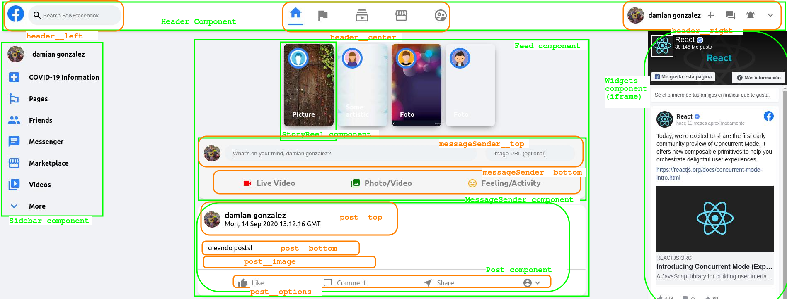

Click in the link to see a
[<strong>Live demo</strong>](https://fb-clone-7643c.web.app/)

### scheme

## Available Scripts

In the project directory, you can run:

### `npm start`

Runs the app in the development mode. 
Open [http://localhost:3000](http://localhost:3000) to view it in the browser.

The page will reload if you make edits. 
You will also see any lint errors in the console.

### `npm test`

Launches the test runner in the interactive watch mode. 
See the section about [running tests](https://facebook.github.io/create-react-app/docs/running-tests) for more information.

### `npm run build`

Builds the app for production to the `build` folder. 
It correctly bundles React in production mode and optimizes the build for the best performance.

The build is minified and the filenames include the hashes. 
Your app is ready to be deployed!

See the section about [deployment](https://facebook.github.io/create-react-app/docs/deployment) for more information.

## How to deploy this app in firebase?

1- Go to https://firebase.google.com/ and access to the console.

2- Create a new project, choose a name and go on!.

3- Create database for messages. Go to Cloud Firestore and create a new collection and call it "posts".
Fields:
image
message
profilePic
timestamp
username

4- Install firebase-tool globaly

### `npm install -g firebase-tools`

5- Login to firebase

### `firebase login`

6- Init firebase

### `firebase init`

#### choose hosting option!

This will create two files firebase.json and .firebaserc

7- If you do not build the app run

### `npm run build`

8- Deploy to firebase!

### `firebase deploy`
